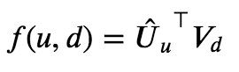
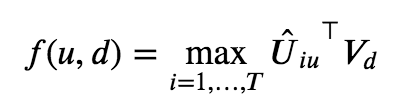
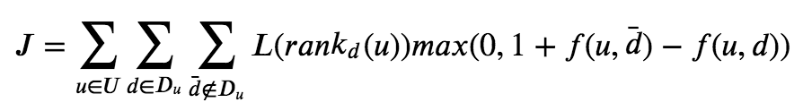
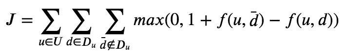
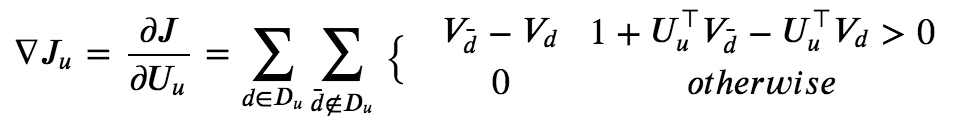
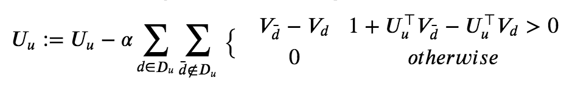
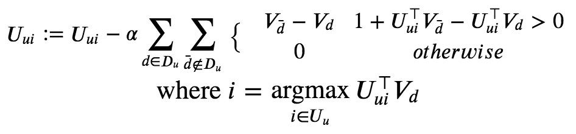

# Nonlinear Latent Factorization (Work In Progress)

### To-Do:
- Whiteboarding Finished!!
- Code Linear Model
  - Optional but should do: Variable sizes per user (maybe do this at the end)
  - Optional: Use TQDM for GD function
  - Optional: Adaptive learning rate
  - Train/test validation
- Code Nonlinear Model
  - Inherit as much as possible from LinearModel parent class
  - Cluster initialization
  - Max-nonlinearity

## Introduction
This project was inspired by research done at [Condé Nast](https://www.condenast.com/) presented at an event by [Dataiku](https://www.dataiku.com/) on October 23, 2019.

The starting point for the idea of a content-based recommendation system based on Nonlinear Latent Factorization (NLF) is a paper by [Weston et. al. (2013)](https://www.researchgate.net/publication/262245974_Nonlinear_latent_factorization_by_embedding_multiple_user_interests) in which they describe a system of using multiple "interest units" to describe each user and differentiating between them by only using the one providing the best user-item relationship while ignoring the others.

From the paper:
> The key idea of the proposed model is to define T interest vectors per user, where the user part of the model is written as Uˆ which is an m × |U| × T tensor. Hence, we also write Uˆiu ∈ R m as the m-dimensional vector that represents the ith of T possible interests for user u. The item part of the model is the same as in the classical user-item factorization models, and is still denoted as a m×|D| matrix V.

This is a bit abstract still, but makes more sense in the context of content-based recommendations.   The original paper optimizes both User and Item vectors to get the best user-item pairings, in the typical style of a fully collaborative recommendation system enabled by matrix decomposition.  Instead, my project uses doc2vec-generated item vectors so that the original relative meaning between items, based on their actual content, is not lost.

---

## Some Math
### Variable Glossary
| variable | definition                                                                              |
|----------|-----------------------------------------------------------------------------------------|
| U        | All users                                                                               |
| u        | Single user                                                                             |
| i        | Interest unit                                                                           |
| T        | Number of discrete user interests (don't confuse this with the vector transpose symbol) |
| V        | Item vectors                                                                            |
| D        | Corpus (all items)                                                                      |
| D_u      | Items relevant to a user                                                                |
| d        | Item relevant to a user                                                                 |
| d-bar    | Item irrelevant to a user                                                               |
| f        | Scoring function                                                                        |
| L        | function which weights a user's rank of an item                                         |
| J        | cost/objective function                                                                 |
| alpha    | Gradient descent learning rate                                                          |

#### Linear Scoring Model

The basic scoring evaluates vector similarity using dot product.  This is inspried by document similarity in doc2vec.  A bigger dot product means that vectors are more similar.  This equation will be used to evaluate model 1.

#### Nonlinear Scoring Model

Each user interest vector, _i_ is considered for the nonlinear scoring model.  Only the best vector is chosen for the nonlinear scoring model.  This equation will be used to evaluate model 2.

#### Original Cost Function

Above is the original cost funciton from (Weston 2013) which is actually borrowed from an earlier paper, also by Weston and his Google colleagues, written in 2008.  Notice that it is adapatble for both scoring models.  It breaks down like this: A partial cost is evaluated for each user, for each item _d_ relevant to that user from the whole corupus _D_, and each item irrelevant to that user _d-bar_.  The sum of all of these pieces composites an overall cost function.

The L(rank(d)) function allows for weighting a user's ranking systems in order to tweak bias in the model.  However, this is not actually useful for a binary ranking system (like in this project), as it is constant.  The "1+... term is used to implement "hinge" loss, and is useful as a form of regularization in gradient descent.

#### Modified Cost Function

As stated above, L(rank(d)) cancels out and is not relevant for the purposes of this particular project.

---

### Linear Model (Model 1)
#### Gradient

The gradient is found by taking the partial derivative of the objective funciton with respect to a user's vector.

#### Gradient Descent - User Vector Update

User vectors are updated using the gradient above.  (Weston 2013) describes a process for stochastic gradient descent (SGD) which is not exactly relevant for the purposes of this project since the item vectors, V, are static and predetermined by doc2vec rather than objective function minimization.  I used mini-batch gradient descent instead, in part substituting vectorized tensor orperations for iterative functions.

---

### Nonlinear Model (Model 2)
#### Gradient
!!! Fix equation !!!

The gradient for the nonlinear funciton is similar to the lienar model, but uses the particular interest unit per user which is most relevant to the selected relevant item d.

#### Gradient Descent - User Vector Update

The equation above describes the update process for the particular interest unit i for a given user U_u.  Note that only one interest unit is updated per instance of this equation while the others are ignored.

# Project Outline

Skipping the first step (for now), I've chosen a [dataset from kaggle](https://www.kaggle.com/gspmoreira/news-portal-user-interactions-by-globocom) with user interactions on the Brazilian news site [Globo](https://www.globo.com/).  They've already vectorized each document with vector length *m* = 250.

## Model 1 - Linear Latent Factorization

### Pipeline Notes
### Evaluation

### Model 2 - Nonlinear Latent Factorization
### Pipeline Notes
#### User interest partitioning
1. User-by-user clustering
2. Interest unit optimiztion through SGD

#### Evaluation
---

## Works Cited and Further Reading
- [Weston 2013](https://www.researchgate.net/publication/262245974_Nonlinear_latent_factorization_by_embedding_multiple_user_interests)
- [Weston 2011](https://www.researchgate.net/publication/220815909_WSABIE_Scaling_up_to_large_vocabulary_image_annotation)
- [Keqin 2008](https://www.researchgate.net/publication/221324580_A_New_Effective_Collaborative_Filtering_Algorithm_Based_on_User's_Interest_Partition)
[Yasdi](https://www.patrickbaudisch.com/interactingwithrecommendersystems/WorkingNotes/RaminYasdiAcquisitionOfUsersInterests.pdf)
