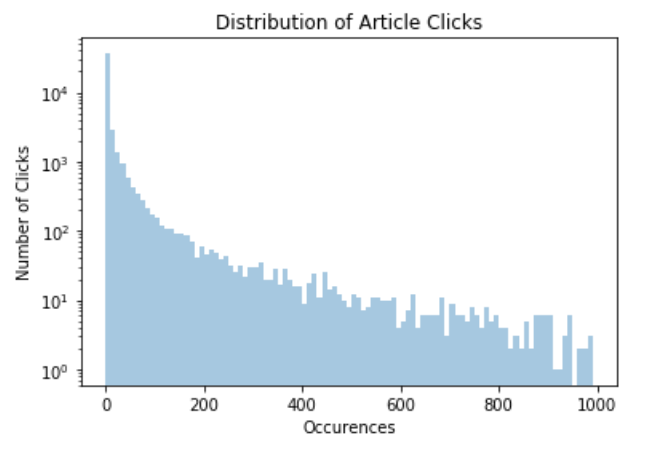
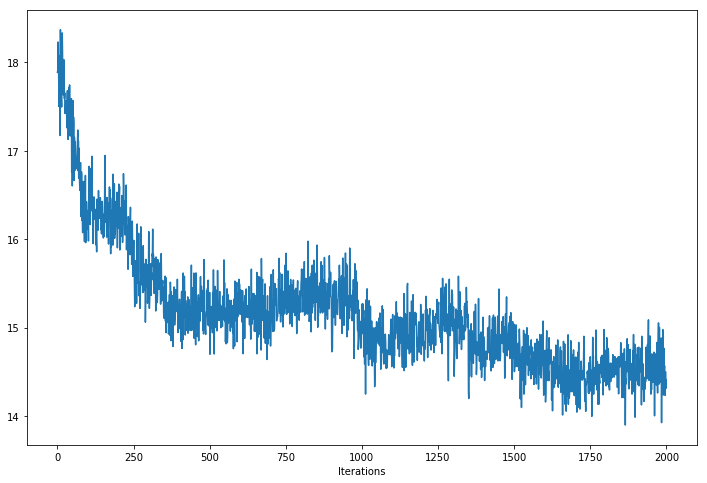

# Nonlinear Latent Factorization (WIP)
## Abstract
Recommendation systems help websites serve you new content similar to what you already like.  Sometimes, this is done by describing users with a set of abstract numbers (you) which they then compare to other sets of abstract numbers (content on the website).  Some people (Google for examle) think this is too simple a model because people can be interested in many types of content that are not necessarily related to each other.  Instead, we can use multiple sets of numbers for each user rather than just one set.

How is this different from using just _more numbers_?  Let's look at what the numbers in question actually represent.  To determine how relevant an item might be for a particular user, a similarity score is calculated between the numbers representing that item and the numbers representing that user.  However, users can be interested in many things that are not necessarily related, and therefore there interests cannot be described in one dimension.

This project builds a model using vector representations of documents read by different users on a website to try to give the best possible recommendations for users based on their individual interests.  This is a content-based recommendation system, meaning that recommendations are based on the content of the documents themselves, rather than mutual interactions with the documents between users.  All of the research used for this project is oriented around collaborative recommendation, so document vectors are used in place of optimized item embeddings, but most of the math is otherwise the same.

## Introduction
This project was inspired by research done at [Condé Nast](https://www.condenast.com/) presented at an event by [Dataiku](https://www.dataiku.com/) on October 23, 2019.

The starting point for the idea of a content-based recommendation system based on Nonlinear Latent Factorization (NLF) is a paper by [Weston et. al. (2013)](https://www.researchgate.net/publication/262245974_Nonlinear_latent_factorization_by_embedding_multiple_user_interests) in which they describe a system of using multiple "interest units" to describe each user and differentiating between them by only using the one providing the best user-item relationship while ignoring the others.

From the paper:
> The key idea of the proposed model is to define T interest vectors per user, where the user part of the model is written as Uˆ which is an m × |U| × T tensor. Hence, we also write Uˆiu ∈ R m as the m-dimensional vector that represents the ith of T possible interests for user u. The item part of the model is the same as in the classical user-item factorization models, and is still denoted as a m×|D| matrix V.

This is a bit abstract still, but makes more sense in the context of content-based recommendations.   The original paper optimizes both User and Item vectors to get the best user-item pairings, in the typical style of a fully collaborative recommendation system enabled by matrix decomposition.  Instead, my project uses doc2vec-generated item vectors so that the original relative meaning between items, based on their actual content, is not lost.

Once vectors are optimized for each user, recommendations can be made based on vector similarity.

---

## Some Math
### Variable Glossary
| variable | definition                                                                              |
|----------|-----------------------------------------------------------------------------------------|
| U        | All users                                                                               |
| u        | Single user                                                                             |
| i        | Interest unit                                                                           |
| T        | Number of discrete user interests (don't confuse this with the vector transpose symbol) |
| V        | Item vectors                                                                            |
| D        | Corpus (all items)                                                                      |
| Du      | Items relevant to a user                                                                |
| d        | Item relevant to a user                                                                 |
| d-bar    | Item irrelevant to a user                                                               |
| f        | Scoring function                                                                        |
| L        | function which weights a user's rank of an item                                         |
| J        | cost/objective function                                                                 |
| alpha    | Gradient descent learning rate                                                          |
| h        | Hinge regularization parameter (typically 1)                                            |

#### Linear Scoring Model

The basic scoring evaluates vector similarity using dot product.  This is inspried by document similarity in doc2vec.  A bigger dot product means that vectors are more similar.  This equation will be used to evaluate model 1.

#### Nonlinear Scoring Model

Each user interest vector, _i_ is considered for the nonlinear scoring model.  Only the best vector is chosen for the nonlinear scoring model.  This equation will be used to evaluate model 2.

#### Original Cost Function

Above is the original cost funciton from (Weston 2013) which is actually borrowed from an earlier paper, also by Weston and his Google colleagues, written in 2008.  Notice that it is adapatble for both scoring models.  It breaks down like this: A partial cost is evaluated for each user, for each item _d_ relevant to that user from the whole corupus _D_, and each item irrelevant to that user _d-bar_.  The sum of all of these pieces composites an overall cost function.

The L(rank(d)) function allows for weighting a user's ranking systems in order to tweak bias in the model.  However, this is not actually useful for a binary ranking system (like in this project), as it is constant.  The "1+... term is used to implement "hinge" loss, and is useful as a form of regularization in gradient descent.

Using this equation with the nonlinear scoring model allows for a type of "max-based" nonlinearity.

#### Modified Cost Function

As stated above, L(rank(d)) cancels out and is not relevant for the purposes of this particular project.

---

### Linear Model (Model 1)
#### Gradient

The gradient is found by taking the partial derivative of the objective funciton with respect to a user's vector.

#### Gradient Descent - User Vector Update

User vectors are updated using the gradient above.  (Weston 2013) describes a process for stochastic gradient descent (SGD) which is not exactly relevant for the purposes of this project since the item vectors, V, are static and predetermined by doc2vec rather than objective function minimization.  I used mini-batch gradient descent instead, in part substituting vectorized tensor orperations for iterative functions.

---

### Nonlinear Model (Model 2)
#### Gradient

The gradient for the nonlinear funciton is similar to the lienar model, but uses the particular interest unit per user which is most relevant to the selected relevant item d.

#### Gradient Descent - User Vector Update

The equation above describes the update process for the particular interest unit i for a given user Uu.  Note that only one interest unit is updated per instance of this equation while the others are ignored.  Tweaking the hinge regularization parameter, represented here with just "1", is key here for optimization.

# Project Outline

Skipping the document vectorization step, I've chosen a [dataset from kaggle](https://www.kaggle.com/gspmoreira/news-portal-user-interactions-by-globocom) with user interactions on the Brazilian news site [Globo](https://www.globo.com/).  They've already vectorized each document with vector length _m_ = 250.

#### Data Summary
- Vector size (m): 250
- Unique articles: 364,047
- Relevant Articles: 46,033
- Unique users: 322,897
- User-article interactions: 2,951,986

The graph below shows the cumulative number of users who have read at least n articles (articles on x-axis, users on y-axis.)

I used this to pick n>=10 and used 8 for the training set.

## Model 1 - Linear Latent Factorization
### Pipeline Notes
#### Initialization
The `NonlinearModel` class can produce linear and nonlinear models depending on the value of `T`.  Much of the boolean broadcasting and indexing used in the nonlinear model becomes irrelevant when T is set to 1.  First, user vectors are initialized by taking the simple mean of document vectors for the documents relevant to each user.
#### Optimization
Then, the user vectors are further optimized in gradient descent.  A set number of items per user is used in each iteration of gradient descent.  This is given by `size` where all items are unique per user.  Increasing `batch_size` repeats those unique relevant items (∈ Du) but with new items _not_ relevant to the user (∉ Du).  The learning rate is also scaled by batch size for consistency, since gradients from each pair of items are summed at each iteration.  Otherwise, larger batches would produce larger gradients.  `test_size` is used for validation at each step to compute the objective function J for the updated user vectors, the relevant document vectors which remain constant, and a new randomly chosen set of document vectors not relevant to users.  `gd_algorithm` tells whether or not to use RPROP.

Using a learning rate of 0.001, the objective function minimizes at roughly 80 iterations.

## Model 2 - Nonlinear Latent Factorization
### Pipeline Notes
#### User interest partitioning
The key first step of the nonlinear model is "user interest partitioning" in which user interests _i_ are initialized.  Collaborative algorithms tend to initialize _i_ randomly but for the purposes of this project, in which item vectors _V_ are predefined, it makes more sense to initialize U based on V before optimization with gradient descent.
#### Initialization
First user interest vectors are initialized on a per-user basis using a modified k-means clustering algorithm, _k_ being equal to the number of latent vectors per user, or equivalent to _T_.  The function is broadcastable and runs simultaneously for all users.
#### Optimization
Once vectors are initialized, vectors are updated at each step of gradient descent using the equations in the math section above.  Gradient calculation is not quite as straightforward as for the linear model, since only one interest unit should be updated per user-item interaction.

A |U| x T x `size` x m tensor is used to start, where are repeated across the user interest axis _T_ times, then multiplied by a boolean matrix along the third axis and summed to produce a |U| x T x m gradient tensor.  The boolean matrix is determined per user, per item, by the maximum dot product between user vectors and the relevant item.  This can be modified by `use_vdbar_for_interest_unit`, which considers the overall cost per item pair.  Additionally, the hyperparameter `readj_interval` determines how often the best interest unit is calculated.

The biggest challenge in optimizing the nonlinear model is the low signal-to-noise ratio.  Randomness of item pairings, while essential for generalized optimization, makes taking effective steps in gradient descent extremely difficult.  Some effective was around this problem are as follows:

- Interest Unit Readjustment - Using higher values for `readj_interval` allows interest units to adjust effectively before being thrown off by more noisiness in the data.  However, convergence with this strategy is very slow.
- Learning Rate - Much higher learning rates than for the linear model help to escape local minima.
- Batch Size - Larger batch sizes help to control noisiness.
- Regularization - Adjusting regularization ended up being the most effective way to ensure fast, consistent convergence.  The regularization parameter in the hinge loss adjustment can be tweaked to change the gradient, although the default parameter value of 1 is still used in the end calculation.  Too high a value leads to divergence.  Too low a value prevents optimization.

Optimization with h = 5 and alpha = 0.1 is shown below.

## CROSS VALIDATION

... not done yet.

---

### To-Do:
#### High priority:
- Train/test validation for both models
- Update readme

#### Low Priority
 - Variable sizes per user (requires forward-filling (or back-filling) with NANs)
 - Investigate why clustering doesn't work for k > n/2

## Works Cited and Further Reading
- [Weston 2013](https://www.researchgate.net/publication/262245974_Nonlinear_latent_factorization_by_embedding_multiple_user_interests)
- [Weston 2011](https://www.researchgate.net/publication/220815909_WSABIE_Scaling_up_to_large_vocabulary_image_annotation)
- [Keqin 2008](https://www.researchgate.net/publication/221324580_A_New_Effective_Collaborative_Filtering_Algorithm_Based_on_User's_Interest_Partition)
- [Yasdi](https://www.patrickbaudisch.com/interactingwithrecommendersystems/WorkingNotes/RaminYasdiAcquisitionOfUsersInterests.pdf)
